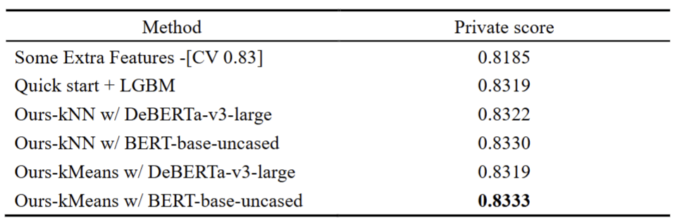

# Automated Essay Scoring 2.0 Competition

This project focuses on the Automated Essay Scoring 2.0 Competition on Kaggle, aiming to design models capable of accurately evaluating student essays. 

Based on our survey, competing teams generally adopt one of two main approaches: fine-tuning language models like DeBERTa to fit the competition dataset or extracting meaningful feature representations directly from the raw text. Many teams also combine these strategies using model ensemble techniques to boost performance. 

Our team focused on extracting meaningful features from the data to improve model performance. After analyzing the training samples for patterns, we proposed a cluster-based approach that combines feature engineering with deep semantic features from language models, aiming to maximize the accuracy and reliability of essay scoring.

kaggle link: https://www.kaggle.com/competitions/learning-agency-lab-automated-essay-scoring-2

# Running

Exucute final-project/group66-final-project.ipynb on kaggle with related input:

https://www.kaggle.com/datasets/datafan07/sent-debsmall

https://www.kaggle.com/datasets/nbroad/persaude-corpus-2

https://www.kaggle.com/datasets/datafan07/feedback-data

https://www.kaggle.com/datasets/hiromoon166/deberta-v3-large

https://www.kaggle.com/datasets/gaslauhfiejfjp/deberta

https://www.kaggle.com/datasets/hoangsang2938/bert-base-uncased

https://www.kaggle.com/datasets/gaslauhfiejfjp/bert-cls

https://www.kaggle.com/datasets/hideyukizushi/aes2-400-20240419134941

https://www.kaggle.com/datasets/datafan07/aes-whls
